 

   
   ### Hi there 👋
   

- 🌱 I’m currently learning **Angular** :smiley:

- :technologist: My projects are available at https://github.com/IvaSabotinova

- 📫 How to reach me: ivasabotinova@gmail.com

- 😄 Pronouns: Съботинова :smile:

- ⚡ Fun fact: No background knowledge or experience with programming before SoftUni :grinning:

------------------------------------------------------------------------------------------------------------
 
 <h2 align="center">📈 Github Stats</h2>

  &nbsp;&nbsp;
  

----------------------------------------------------------------------------------------------------------

  

### :link:		Programming Languages And Technologies
 

  &nbsp;&nbsp;&nbsp;
  &nbsp;&nbsp; &nbsp;
  &nbsp;&nbsp; &nbsp;
  &nbsp;&nbsp; &nbsp;
  &nbsp;&nbsp; &nbsp;
   &nbsp;&nbsp; &nbsp;
 &nbsp;&nbsp; &nbsp;
  &nbsp;&nbsp; &nbsp;
   &nbsp;&nbsp; &nbsp;
  &nbsp;&nbsp; &nbsp;
 &nbsp;&nbsp; &nbsp;
 &nbsp;&nbsp; &nbsp;
  &nbsp; &nbsp;
   &nbsp;&nbsp;&nbsp;
  &nbsp;&nbsp;&nbsp;

------------------------------------------------------------------------------------------------------------

  
 
### 🤝 Connect with me: &nbsp;  

